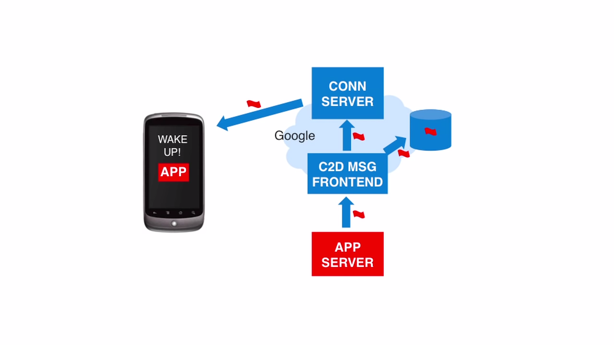

## Android 2.2 Froyo Official Video

> https://youtu.be/yAZYSVr2Bhc
>
> Highlights from the latest Android platform release
>
> ✨Clue #5✨
>
> You got clue number five and if you've still got the bandwidth, try to
> find the next clue in our video for Ice Cream Sandwich. ☺️

---

We are pleased to announce Android 2.2. There are four areas we'd like to
highlight in this video.

1. Speed
2. APIs and Services
3. Browser
4. Android Market

> **1. Speed**
> - Dalvik VM: Just-In-Time (JIT) Compiler = 2-5X faster performance

We're working to continue improving overall speed and performance on Android. In
Android 2.2, the newly introduced Dalvik JIT Compiler delivers a two to five X
performance boost to CPU-bound code compared to Android 2.1. In this demo
version of the game Replica Island, the screen turns red when the CPU is unable
to keep the game simulation thread above 30 frames per second. Here, the Android
2.2 device with JIT maintains a game simulation frame rate above 35, while the
2.1 device quickly goes below 30.

> **2. APIs and Services**
> - Cloud to Device Messaging
> - Application Backup API
> - Apps on SD Card
> - Portable Hotspot

Developers can use Android Cloud to Device Messaging to easily enable alerts,
send to phone, and two-way sync functionality for their Apps. With this API, an
App server can send authenticated messages to the Google server, which could
push the message to the App on a user's device.

In this example, a developer has used Android Cloud to Device Messaging to
enable a URL send to phone extension from the desktop browser that automatically
opens the push page with the appropriate App here at Google Maps. The App Backup
API enables any App to have its.

The App Backup API enables any App to have its data backed up and then restored
when installed on a new device. The feature is controlled by users via the
automatic restore setting on their device. With Android 2.2, developers by users
via the automatic restore setting on their device. With Android 2.2, developers
can specify whether they want their App installed on a device's SD card. For
Apps residing on the SD card, users can move the App from the SD card to
internal storage and back from the manage application settings. In Android 2. 2
introduces the ability to use ones phone as a portable hotspot. Users can
activate portable hotspot on their phone then connect their computer to the
portable hotspot to get internet access.

> **3. Browser**
> - V8 = 2-3X faster javascript rendering

We're continuing to make the browser better and faster. Android 2.2 introduces
the V8 JavaScript engine which provides a two to three X improvement in
JavaScript rendering times compared to Android 2.1. You can see the difference
in the side-by-side visualizations of the respective SunSpider JavaScript
benchmarking test results.

> **4. Android Market**
> - Auto Update and Update All
> - Application Error Reports

We're introducing several new features to Android market. Users can choose 
to let an App auto-update as long as permissions remain unchanged. User can 
also update all Apps with unchanged permissions with a single click.

Application Error Reports will provide to developers App crash and freeze 
reports submitted by users. These reports will be available to developers 
through their Android Market publisher account.

To learn more about Android 2.2, please go to our website, developer.android.
com.