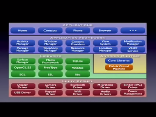
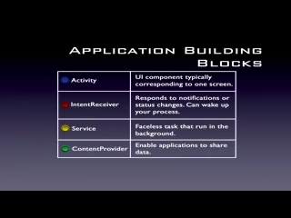
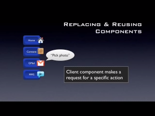

# Androidology - Part 1 of 3 - Architecture Overview

> https://youtu.be/QBGfUs9mQYY
>
> Part 1 of 3 in an overview series on the Android platform. In this segment,
> Mike gives an overview of the system architecture.

---

Hi, my name is Mike Cleron. I'm an engineer on the Android Development Team.

Android is an open software platform for mobile development. It is intended to
be a complete stack that includes everything from the operating system through
middle ware and up through applications.

In the next few minutes, I'm going to be introducing you to an overview of the
architecture of the Android platform. And I'm also going to talk about some of
key principles that are underlying its design. If I'm going to talk about
architecture, we need to start with a diagram covered with a lot of little boxes
and this is ours.

Our architecture, we're going to start at the bottom work up.

Our architecture is based on the Linux 2.6 Kernel. We use the Linux Kernel as
our hardware abstraction layer. So, if you are an OEM trying to bring up Android
on a new device, the first thing you do is bring up Linux and get all your
drivers in place. The reason we're using Linux is because it privides a proven
driver model in a lot of cases existing drivers. It also provides memory
management, process management, a security model, networking, a lot of core
operating system infrastructures that are robust and have been proven over time.

The next level up is our native libraries. Everything that you see here in green
is written in C and C plus, plus. It's at this level where a lot of the core
power of the Android platform comes from. I'm just going to go through and
describe what some of these components are. I'm going to start with the surface
manager. The surface manager is responsible for composing different drawings
surfaces onto the screen. So it's the surface manager that's responsible for
taking different windows that are owned by different applications that are
running in different processes and all drawing at different times and making
sure the pixels end up on the screen when they're supposed to. Below that we
have two boxes, OpenGL/ES and SGL and these two make up the core of our graphics
libraries. OpenGL/ES is a 3D library. We have a software implementation that is
hardware acceleratable if the device has a 3D chip on it. The SGL graphics are
for 2D graphics and that is what most of our application drawing is based on.
One interesting thing about the Android graphics platform is that you can
combine 3D and 2D graphics in the same application. Moving over, we have the
Media Framework. The Media Framework was provided by PacketVideo, one of the
members of the open handset alliance and that contains all of the codex that
make up the core of the media experience. So, in there you'll find IMPEG 4,
H.264, MP3, AAC, all the video and video codex you need to build a rich media
experience. We use Free Type to render our fonts. We have an implementation of
SQLite, we use that as the core of most of our data storage. We have WebKit
which is the open source browser engine, that's what we're using as a core of
our browser. It's the same browser that's powering Safari from Apple and we'd
made some, we've worked with that engine to make it render well on small screens
and on mobile devices.

Next is The Android Runtime. And the main component in the Android Runtime is
the Dalvik Virtual Machine. The Android Runtime was designed specifically for
Android to meet the needs of running in an embedded environment where you have
limited battery, limited memory, limited CPU. The Dalvik Virtual Machine runs
something called dex files, D-E-X. And these are bytecodes that are the results
of converting at build time .Class and .JAR Files. So, these files when they are
converted to .dex, become a much more efficient bytecode that can run very well
on small processors. They use memory very efficiently. The data structures are
designed to be shared across processes whenever possible. And it uses a highly
CPU optimized bytecode interpreter. The end result of that is that it's possible
to have multiple instances of the Dalvik Virtual Machine running on the device
at the same time, one in each os several processes and we'll see why that's
important a little bit later on. The next level up from that is the Core
Libraries. This is in blue, meaning that it's written in the Java programming
language. And the Core library contains all of the collection classes,
utilities, IO, all the utilities and tools that you've come to expected to use.

Moving up again, we now have the Application Framework. This is all written in a
Java programming language and the application framework is the toolkit that all
applications use. These applications include the ones that come with a phone
like the home application, or the phone application. It includes applications
written by Google, and it includes applications that will be written by you. So,
all applications use the same framework and the same APIs. Again, I'm going to
go through and talk about what some of the main components are in this layer, in
the Application Framework. The activity manager is what manages the life cycle
of applications. It also maintains a common backstack so that applications that
are running in different processes can have a smoothly integrated navigation
experience. Next down from that is the package manager. The package manager is
what keeps track of which applications are installed on your device. So, if you
download new applications over the air or otherwise install applications, it's
the package manager that's responsible for keeping track of what you have and
what the capabilities of each of your applications are. The window manager
manages Windows. It's mostly a Java programming language abstraction on top of
lower level services that are provided by the surface manager. The telephony
manager contains the APIs that we use to build the phone application that's
central to the phone experience. Content providers are a unique piece of the
Android platform. That's a framework that allows applications to share their
data with other applications. We use that in our contacts application so that
all of the information in contacts, phone numbers, addresses, names is available
to any application that wants to make use of them. And other applications can
use that facility as well to share data. The resource manager is what we use to
store local iStrings, bitmaps, layout file descriptions, all of the external
parts of an application that aren't code. I'm just going to touch lightly on the
remaining four boxes, view system, location manager, notification manager and
XMPP service. The view system contains things like buttons and lists, all the
building blocks of the UI. It also handles things like event dispatching,
layout, drawing. Location manager, notification manager and XMPP service are
some APIs that I think will allow developers to create really innovative and
exciting applications.

And the final layer on top is Applications. This is where all the applications
get written. It includes the home application, the contacts application, the
browser, your applications. And everything at this layer is, again, using the
same application framework provided by the layers below.

Now, if you're going to write an application, the first step is to decompose it
into the components that are supported by the Android platform. Here are the
four major ones. We have activity, intent receiver, service, and content
provider.

An activity is essentially just a piece of UI typically corresponding to one
screen. So if you think of something like the mail application, that would be
decomposed into maybe three major activities, something that lists your mail,
something that shows you what an individual mail message and a compose screen to
put together an outgoing email.

An intent receiver is something different. An intent receiver is a way for which
your application to register some code that won't be running until it's
triggered by some external event. And the set of external events that triggers
your code is open and extensible. So you can write some code and through XML,
register it to be woken up and run when something happens, when the network, the
network activities established or at a certain time or when the phone rings or
whatever trigger makes sense for your application.

The next major component is a service. A service is a task that doesn't have any
UI, that's long lived, that's running in the background. A good example is a
music player. You may start playing some music from an activity, from a piece of
UI, but once the music is playing, you'd want it to keep playing even if you're
navigating to other parts of the user experience. So the code that's actually
running through the playlist playing songs would be a service, that's running in
the background. You can connect to it later if you want to from an activity or
some other component by binding to the service and sending messages like "skip
to the next" or "rewind".

The last component is a content provider and, again, that's a component that
allows you to share some of your data with other processes and other
applications. Now, any application can store data in whatever may--way it makes
sense for that application. They can store it in the files. They can store it in
our super light database, whatever makes sense. But if they want to make that
data available as part of the platform so that other applications can make use
of it, then the content provider is the solution for that and we've used that
for the context database that comes with the Android platform so that any
application can make use of the information in context.

Android was designed at a fundamental level to encourage reusing and replacing
components. I have an example here that shows how that works. On the left, there
are four applications that might want to pick a photo for some reason. So the
home application might want to pick it for wallpaper. Contacts might want to
pick a person's face to associate with their contact card. Gmail or MMS, you
might want to have a photo that you sent to someone in an outgoing message. Now,
an Android for these applications to make use of the service of taking a photo,
they first need to make a request. So the client comonent makes a request for
sepcific action. In this case, I'm illustrating that with a talk balloon and the
Gmail application is requesting that it picks a photo. So the talk balloon is
actually representation of a formal class in our system called an intent. What
the system does when a request is made is it looks at all of the installed
components and it finds the best available component that knows how to do
whatever was asked for. In this case, let's say that the system finds the
built-in photo gallery. Now, what happens is the Gmail application is now
connected to the photo gallery. When the user in Gmails wanted to pick a photo,
he will be taken to the photo gallery and the photo gallery will fulfill
whatever was asked for in the intent. What makes this interesting is that the
picking of the matching component is late bound, it's done very late and so you
can swap software components at any time. So let's say you didn't like the
built-in photo gallery and you wanted to replace it with one that went online to
find a richer or bigger set of photos. You can replace our built-in photo
gallery with one that say goes out to Picasso or whatever your favorite online
photo site is. Once you've done that, then any of the applications on the left
will now use the new and better component on the right to fulfill the task of
picking a photo. And at any time, a new application can come along and make use
of existing functionality. So if you're writing a blogger application, you don't
have to worry about writing a photo picker yourself. You can just rely on
whichever one the user has configured to be their preferred photo picking
application. This becomes really important because in Android, it's not just
about picking photos, virtually any task has an intent in the middle. If the
user is going from point A to point B, there's an intent in the middle and each
of those intents is an opportunity to reuse a component or to replace a
component. So we have intents for going home which means you can replace a home
application. Or we have an intent for sending an email which means you can
replace the mail application. All of these are opportunities for replacing and
reusing components.

If you're interested in finding out more about Android, I encourage you to visit
the developer site and download the SDK. In the SDK, you'll find a lot more
documentation and sample code and you'll also be able to try building
applications of your own. There's also a developer group that you can join to
find out more information and I also encourage you check back frequently because
we'll be posting updates to the SDK as the platform matures.

Thank you for watching.
